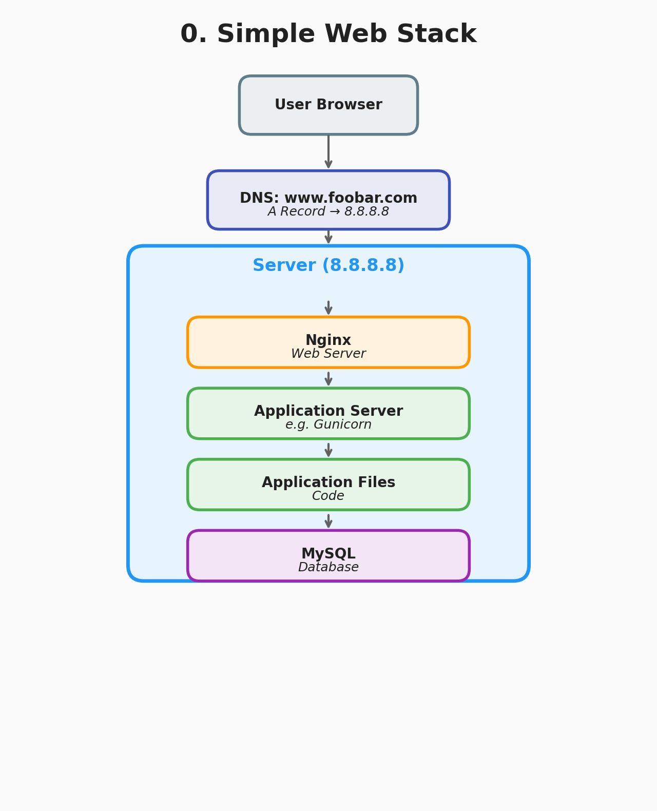

# 0. Simple Web Stack

## Infrastructure Diagram

## User Journey

A user opens their browser and types `www.foobar.com`. The browser sends a DNS request to resolve the domain. The DNS returns the A record pointing to IP `8.8.8.8`. The browser then sends an HTTP request to that IP. The server at `8.8.8.8` receives the request, Nginx serves as the entry point, forwards it to the application server, which queries the MySQL database if needed, and returns the response back through Nginx to the user's browser.

## Specifics

- **What is a server?**
  A server is a physical or virtual machine that provides resources, data, or services to other computers (clients) over a network. In this case, it hosts the entire web stack.

- **What is the role of the domain name?**
  The domain name (`foobar.com`) is a human-readable address that maps to the server's IP address via DNS. It allows users to access the website without memorizing an IP address.

- **What type of DNS record is `www` in `www.foobar.com`?**
  It is an **A record** (Address record). It maps the subdomain `www.foobar.com` directly to the IPv4 address `8.8.8.8`.

- **What is the role of the web server (Nginx)?**
  Nginx handles incoming HTTP requests from users. It serves static files, forwards dynamic requests to the application server, and manages connections efficiently.

- **What is the role of the application server?**
  The application server executes the application code. It processes business logic, handles user input, and generates dynamic content. It communicates with the web server and the database.

- **What is the role of the database (MySQL)?**
  MySQL stores, retrieves, and manages structured data. The application server queries it to persist user data, sessions, and application state.

- **What is the server using to communicate with the user's computer?**
  The server communicates over the network using the **TCP/IP protocol stack**, specifically **HTTP** (or HTTPS) over **TCP**, on port 80 (or 443).

## Issues with this Infrastructure

1. **SPOF (Single Point of Failure)**
   The entire infrastructure relies on a single server. If it goes down (hardware failure, OS crash, network issue), the website is completely unavailable.

2. **Downtime during maintenance**
   Any maintenance task (deploying new code, updating Nginx, restarting the database) requires stopping services, which makes the website unavailable during that window.

3. **Cannot scale with traffic**
   A single server has finite CPU, RAM, and bandwidth. If traffic spikes, the server will become a bottleneck, leading to slow responses or crashes. There is no way to horizontally scale by adding more servers.
