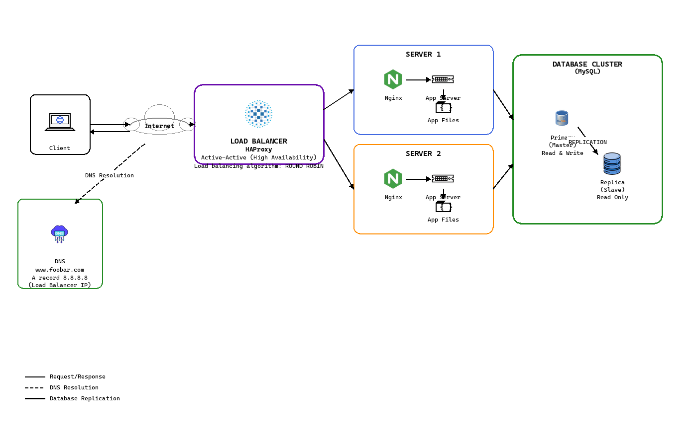

# 1. Distributed Web Infrastructure

- Le rôle du DNS est de traduire l'enregistrement d'un nom de domaine en une adresse IP.
- `www.foobar.com` est un A record car il résout en une adresse IP.
- Ce serveur est un point de défaillance unique car rien n'est redondant.
- Le site serait temporairement indisponible quand du nouveau code est déployé et que le web server doit être redémarré.
- Cette infrastructure ne peut pas scaler et ne pourra pas gérer du traffic qui dépasserait la capacité du serveur.
- Le serveur communique sur un réseau (TCP/IP).

## Spécificités

- Le load balancer est configuré avec l'algorithme Round Robin. Il distribue les requêtes séquentiellement à chaque serveur.
- Le load balancer est en configuration Active-Active. Les deux serveurs reçoivent et traitent les requêtes simultanément.
- Le cluster MySQL Master-Replica utilise la réplication pour garder les données synchronisées. Le Primary reçoit toutes les requêtes d'écriture et les logue dans un binary log. Le Replica se connecte au Primary et lit le binary log, appliquant les mêmes changements à sa propre copie des données de manière asynchrone.
- Le Master database node peut accepter des lectures/écritures tandis que le Replica peut seulement accepter des lectures.

## Problèmes

- Le load balancer est un point de défaillance unique.
- Avoir les mêmes composants sur tous les serveurs (database, web server et application server) peut être un problème car leur consommation ne va pas croître de la même manière entre eux.
- Avoir les mêmes composants sur tous les serveurs peut être un problème car quand il y a de la maintenance sur un serveur pour un composant spécifique, ça affecte les autres composants qui sont dessus.
- Il n'y a pas de firewall sur les serveurs.
- Le traffic n'est pas encrypté.
- Il n'y a pas de monitoring.
