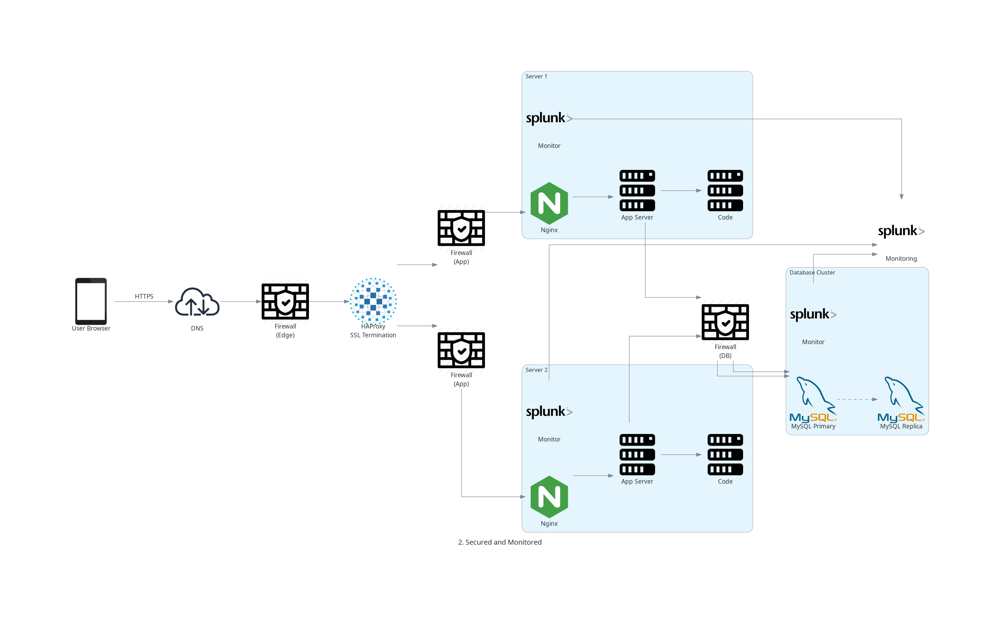

# 2. Secured and Monitored Web Infrastructure

## Explication du schéma

**Le scénario :** Un utilisateur tape `www.foobar.com` dans son navigateur.

**Le flux de la requête :**

1. **DNS** — Le navigateur demande au DNS : "Quelle est l'IP de `www.foobar.com` ?"
2. La requête arrive en **HTTPS** (port 443) sur le **Firewall Edge**
3. Le Firewall filtre le traffic malveillant et le laisse passer vers le **Load Balancer**
4. **HAproxy** reçoit la requête, termine le SSL (déchiffre HTTPS → HTTP)
5. La requête passe par les **Firewalls** des serveurs applicatifs
6. Le **serveur choisi** traite la requête : Nginx → App Server → MySQL
7. Le **Monitoring Client** sur chaque serveur collecte les métriques et les envoie au service de monitoring
8. La réponse remonte jusqu'à l'utilisateur

---

### Pourquoi on ajoute chaque élément

| Élément | Pourquoi on l'ajoute |
|---------|---------------------|
| **3 Firewalls** | Un sur chaque serveur pour filtrer le traffic entrant/sortant. Bloque les accès non autorisés, limite les ports ouverts. |
| **Certificat SSL** | Pour servir `www.foobar.com` en **HTTPS**. Encrypte le traffic entre le navigateur et le serveur. |
| **3 Monitoring Clients** | Agents qui collectent les logs et métriques sur chaque serveur et les envoient à un système de monitoring (ex: Sumologic). |

---

### Spécificités techniques

- **Pourquoi HTTPS :** Si quelqu'un intercepte le traffic réseau (attaque "man in the middle"), les données sont encryptées — il ne peut pas lire le contenu (mots de passe, données personnelles, etc.).

- **Monitoring — comment ça collecte :**
  - Le client monitoring s'exécute sur chaque serveur
  - Il lit les **logs** (Nginx access logs, erreurs applicatives)
  - Il lit les **métriques système** (CPU, RAM, disque, réseau)
  - Il envoie tout ça à un dashboard central où on peut visualiser et configurer des alertes

- **Monitorer le QPS (Queries Per Second) :**
  - Configurer une alerte qui se déclenche si le nombre de requêtes par seconde dépasse un seuil
  - Exemple : "Si QPS > 1000 pendant plus de 5 minutes → envoyer une alerte email/Slack"

---

## Problèmes

- 🔴 **SSL termination au load balancer** — Le LB décrypte HTTPS, mais le traffic entre le LB et les serveurs internes reste en HTTP (non encrypté). Si quelqu'un a accès au réseau interne, il peut lire les données.
- 🔴 **Un seul MySQL Master** — Si le Primary tombe, plus personne ne peut écrire dans la DB. L'application ne peut plus créer/modifier de données.
- 🔴 **Mêmes composants sur tous les serveurs** — On ne peut pas scaler indépendamment. Ex : si on a besoin de plus de puissance DB, on est obligé d'ajouter aussi Nginx + App Server sur la même machine.
