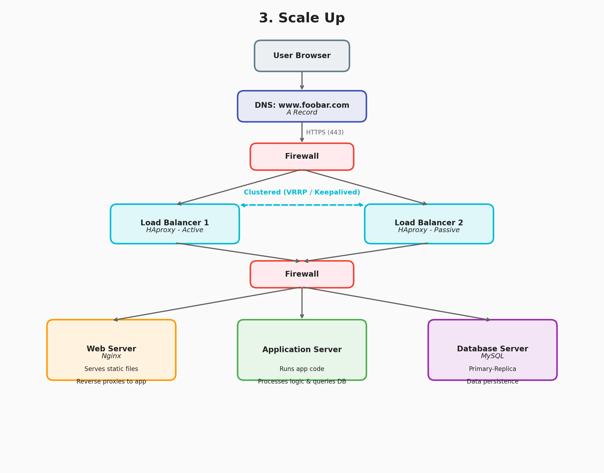

# 3. Scale Up

## Infrastructure Diagram

## Why Each Additional Element Was Added

1. **Additional Load Balancer (HAproxy) configured as a cluster**
   - Eliminates the load balancer as a **Single Point of Failure**.
   - Two HAproxy instances run in a cluster (using VRRP/Keepalived or HAproxy's native peering). If the active load balancer fails, the passive one takes over the virtual IP instantly.
   - Provides redundancy at the entry point and ensures high availability for traffic distribution.

2. **Additional Server**
   - Enables the **separation of concerns** by giving each major component its own dedicated hardware resources.
   - The web server, application server, and database no longer compete for CPU, memory, disk I/O, or network bandwidth on the same machine.

## Specifics

- **Web Server (Nginx) — dedicated server**
  - Receives HTTP requests from the load balancer.
  - Serves static content (images, CSS, JavaScript) directly.
  - Reverse-proxies dynamic requests to the application server.
  - Being on its own machine allows tuning Nginx for maximum connection handling without worrying about app or DB resource usage.

- **Application Server — dedicated server**
  - Receives proxied requests from the web server.
  - Executes the application code, handles business logic, and generates dynamic responses.
  - Queries the database server over an internal network connection.
  - Isolation prevents application memory leaks or CPU spikes from affecting web serving or database operations.

- **Database (MySQL) — dedicated server**
  - Stores all persistent data.
  - Can be configured as Primary-Replica for read scaling and failover.
  - Separation ensures that heavy I/O operations (backups, large queries, index rebuilds) do not slow down the web or application tiers.

- **Splitting components with their own server**
  - This follows the **single responsibility principle**.
  - Each tier can be scaled **independently**. If traffic increases, add more web servers behind the load balancer. If application logic becomes heavier, scale the application tier. If data grows, scale the database tier (bigger machine, faster disk, or read replicas).
  - Troubleshooting becomes easier because logs, metrics, and failure domains are isolated per component.

## What Was Achieved

This architecture moves from a monolithic combined stack to a true **3-tier architecture**:
- **Presentation tier**: Load balancers + Web server
- **Application tier**: Application server
- **Data tier**: Database server

Each tier can be optimized, secured, monitored, and scaled independently. The clustered load balancers provide high availability at the edge. The dedicated servers provide predictable performance and clean failure isolation.

## Remaining Considerations

- The database still represents a potential SPOF for writes unless an automatic failover mechanism (e.g., MySQL Group Replication, Galera, or managed RDS with multi-AZ) is implemented.
- SSL re-encryption from the load balancer to the web server should be considered for true end-to-end encryption.
- Monitoring and alerting should cover all 5 machines plus the load balancer cluster health.
